<!-- ╔══════════════════════════════════════════════════════════════════════╗ -->
<!-- ║  GitHub Profile README — Brandon J. Bello Moncada (@branmarvel)   ║ -->
<!-- ║  Auto-updated via GitHub Actions · Last reviewed: 2025-06        ║ -->
<!-- ╚══════════════════════════════════════════════════════════════════════╝ -->

<!-- ═══════════════════════════════ HEADER ═══════════════════════════════ -->

<div align="center">


[](https://git.io/typing-svg)

[](https://github.com/branmarvel)
[](https://github.com/branmarvel?tab=followers)
[](https://portafolio-brandon-bello.web.app)

<br/>

<h3>🌐 Language / Idioma</h3>

<a href="README.md"> </a>
&nbsp;&nbsp;&nbsp;&nbsp;
<a href="README.es.md"> </a>

</div>

---

<!-- ═════════════════════════════ ABOUT ME ═══════════════════════════════ -->

## 👋 About Me

I am a **Full-Stack Developer** with 4+ years of experience specializing in digital transformation for government and financial sectors. I architect secure, high-performance systems that automate complex workflows and handle large-scale data.

- 🔭 **Currently working on:** Public Asset Management System (Go + Astro + React Native)
- 🌱 **Currently learning:** Advanced AI integrations for automated auditing (n8n + LLMs)
- 📫 **How to reach me:** [brandon91596@gmail.com](mailto:brandon91596@gmail.com)

<br/>


<!-- ════════════════════════════ TECH STACK ══════════════════════════════ -->

## 🛠️ Tech Stack

<details open>
<summary><b>Backend</b></summary>
<br/>


</details>

<details open>
<summary><b>Frontend & Mobile</b></summary>
<br/>


</details>

<details open>
<summary><b>DevOps, Cloud & Automation</b></summary>
<br/>


</details>

<details open>
<summary><b>Data & BI</b></summary>
<br/>


</details>

<br/>

<!-- ═══════════════════════ FEATURED PROJECTS ════════════════════════════ -->

## 🚀 Featured Projects

### 🏛️ Enterprise Systems (Staging / Private Repositories)

> [!NOTE]
> The source code for these platforms remains private under proprietary/governmental confidentiality agreements. The metrics shown represent non-confidential architectural achievements.

<div align="center">

| Project & Description | Staging Status |
|-----------------------|------------------|
| **🏛️ Public Asset Management System (MPPEF)**<br/>**Role:** Architect & Lead Developer (Go & Astro)<br/>• **Architecture:** High-concurrency Go 1.25 (Gin/GORM) API with JWT/RBAC and WebSockets; Astro 5 + React 19 web frontend with ECharts; React Native (Expo SDK 54) mobile app with OCR and biometrics.<br/>• **Scale & Impact:** 100,000+ records migrated to a digital ecosystem with a full audit trail; total digitalization for 150+ active users.<br/>• **Repositories (Private):** [Backend API](https://github.com/branmarvel/asset-management-backend) \| [Frontend Web](https://github.com/branmarvel/asset-management-frontend) \| [Mobile App](https://github.com/branmarvel/asset-app)<br/><br/>`Go 1.25` `Gin` `Astro 5` `React 19` `React Native (Expo)` `PostgreSQL` | 🔒 **SECURE_PRODUCTION**<br/>🌐 *PRIVATE_MINISTRY* |
| **📦 Warehouse & Inventory Control System**<br/>**Role:** Full Stack Developer (Laravel & Vue)<br/>• **Architecture:** Modular Laravel 11 (PHP 8.2) backend + reactive Vue 3/Vite frontend with PrimeVue 4; real-time notifications via Socket.io + n8n/Telegram.<br/>• **Scale & Impact:** Multi-level approval workflows with full traceability and mass PDF generation engine; +60% operational productivity, 30% reduction in logistics errors.<br/>• **Repositories (Private):** [Backend API](https://github.com/branmarvel/almacen_laravel-Almacen-infra) \| [Frontend Web](https://github.com/branmarvel/almacen_vue-Almacen-infra)<br/><br/>`Laravel 11` `PHP 8.2` `Vue 3` `PrimeVue 4` `n8n` `Socket.io` `PostgreSQL` | 🔒 **SECURE_PRODUCTION**<br/>🌐 *PRIVATE_MINISTRY* |
| **🎬 Jutba (Live Streaming & Translation)**<br/>**Role:** Lead Mobile Developer (Flutter)<br/>• **Architecture:** Live audio streaming and simultaneous room-based translation; voice-to-text (STT) transcription via Whisper V3 (Groq API) and theological translation via Llama-3/Gemini (V16 Protocol); REST API & WebSockets with NestJS on Cloud Run and Redis caching.<br/>• **Integration:** Google login, Stripe billing & subscription portal, and Firebase FCM multilingual push notifications.<br/>• **Repositories (Private):** [Backend API](https://github.com/JutbaTranslaterOne/jutba-backend) \| [Frontend Web](https://github.com/JutbaTranslaterOne/jutba-frontend)<br/>• **Video Demo:** 🎥 [Watch Demo on YouTube](https://youtu.be/I87DAt4ZdD4)<br/><br/>`Flutter` `Dart` `NestJS` `Whisper V3` `Llama 3 / Gemini` `Stripe` `Redis` `Firebase FCM` | ⏳ **PUBLIC_RELEASE_PENDING**<br/>🌐 *PUBLIC_CLOUDFLARE* |

</div>

<br/>

### 📂 Public & Personal Projects (Open Source / Practice)

<div align="center">

| Project & Description | Repository Stats / Status |
|-----------------------|------------------|
| **⚽ Footballer Profile & Match Hub (CeleBreak)**<br/>**Role:** Flutter Developer (Clean Architecture)<br/>• **Architecture:** High-performance mobile app under Clean Architecture (decoupled Data, Domain, Presentation layers) with state management via Cubit (BLoC).<br/>• **UI/UX & Features:** Pixel-perfect UI from Figma with custom sliver headers, custom clippers, and SVG support; emulates remote API fetching and lazy loading.<br/>• **Video Demo:** 🎥 [Watch Demo on YouTube](https://youtu.be/MVS1Gzqt5Ms)<br/><br/>`Flutter` `Dart` `BLoC/Cubit` `Clean Architecture` `get_it` | [](https://github.com/branmarvel/profile-CeleBreak-task) |
| **📊 Project Management & Control System**<br/>**Role:** Full Stack Developer (Angular & Firebase)<br/>• **Architecture:** SPA admin dashboard in Angular 17 with a serverless Firebase backend (Firestore, Auth).<br/>• **Features & Impact:** Full project CRUD with planning workflows, Gantt charts, tracking, and real-time reporting; top-graded academic project recognized for its robustness.<br/>• **Live Demo:** 🔗 [sgcp-app.web.app](https://sgcp-app.web.app/#/login)<br/>• **Video Demo:** 🎥 [Watch Demo on YouTube](https://youtu.be/1_30YCtLpRo)<br/><br/>`Angular 17` `TypeScript` `Firebase` `dhtmlx-gantt` `CoreUI` | [](https://github.com/branmarvel/Sistema-para-la-Gestion-y-Control-de-proyectos) |
| **📱 IBC AprendeIT - Educational Learning App (U-Text)**<br/>**Role:** Mobile Developer (Flutter)<br/>• **Architecture:** Native mobile app in Flutter/Dart with Firebase (Auth, Firestore, Cloud Functions).<br/>• **Features & Impact:** Dedicated teacher/student flows with real-time quiz/assessment creation and educational content management; school project with outstanding rating.<br/>• **Live Demo:** 🔗 [u-text-app.web.app](https://u-text-app.web.app)<br/>• **Video Demo:** 🎥 [Watch Demo on YouTube](https://youtu.be/_rpIpp9s7Zo)<br/><br/>`Flutter` `Dart` `Firebase` `ChatGPT SDK` `Provider` | [](https://github.com/branmarvel/U-text) |
| **🌐 Personal Portfolio Website**<br/>• **Architecture:** Premium static page generation with Astro 5, React 19, and Tailwind CSS v4. Features mechanical spring transitions via Framer Motion 12, client-side i18n context, and secure package release age constraints.<br/>• **UX/UI:** Glassmorphic layout with mouse-glow, custom Mac terminal showcases, and automated WakaTime/GitHub metric integration.<br/><br/>`Astro 5` `React 19` `Tailwind v4` `TypeScript` `Framer Motion 12` | [](https://github.com/branmarvel/portafolio) |
| **💱 VesTrack (Ve-Exchange)**<br/>**Role:** Developer & Creator<br/>• **Architecture:** Offline-First Expo/React Native and TypeScript mobile app with local persistent cache (AsyncStorage) and adaptive rate synchronization.<br/>• **Features & UX:** Real-time monitoring of BCV rates (USD/EUR) and Binance P2P offers with advanced filtering, integrated calculator, native dark/light theme support, and haptic feedback.<br/>• **Video Demo:** 🎥 [Watch Demo on YouTube](https://youtu.be/pVpo8PMqKq0)<br/><br/>`Expo` `React Native` `TypeScript` `AsyncStorage` `Tailwind CSS` | [](https://github.com/branmarvel/VesTrack) |
| **📶 movilnet-app (Movilnet Balance Checker)**<br/>**Role:** Developer & UX Creator<br/>• **Architecture:** Expo/React Native and TypeScript mobile app with native Android/iOS support and local persistence.<br/>• **UX & Features:** Single-tap flow for fluid interaction, checking balance, line status, billing cycle date, and historical query tracking.<br/>• **Video Demo:** 🎥 [Watch Demo on YouTube](https://youtu.be/CRh3BbnVRaM)<br/><br/>`Expo` `React Native` `TypeScript` `AsyncStorage` `Tailwind CSS` | [](https://github.com/branmarvel/movilnet-app) |

</div>

<br/>

<!-- ══════════════════════════ ACHIEVEMENTS ══════════════════════════════ -->

## 🏆 Achievements & Certifications

<div align="center">

| | Achievement | Details |
|---|---|---|
| 🥇 | **ICPC — Honorable Mention ×3** | South America Regional Finals (2022, 2023, 2024) |
| 🛡️ | **Google Cybersecurity Certificate** | Coursera (2023) |
| 💼 | **Digital Acumen** | PwC (2023) |

</div>

<br/>

<!-- ═══════════════════════ WAKATIME STATS ═══════════════════════════════ -->

## 📊 WakaTime Coding Stats

<p align="center">
  <a href="https://wakatime.com"></a>
  
</p>

> [!NOTE]
> These statistics represent my coding activity tracked in real-time via WakaTime starting from **June 2026**.

<div align="center">
<!--START_SECTION:waka-->
📊 **This Week I Spent My Time On** 

```text
💬 Programming Languages: 
JavaScript               43 mins             ████████████░░░░░░░░░░░░░   46.25 % 
Markdown                 29 mins             ████████░░░░░░░░░░░░░░░░░   31.33 % 
Dart                     10 mins             ███░░░░░░░░░░░░░░░░░░░░░░   11.68 % 
Astro                    5 mins              █░░░░░░░░░░░░░░░░░░░░░░░░   05.41 % 
HTML                     4 mins              █░░░░░░░░░░░░░░░░░░░░░░░░   04.77 % 

🔥 Editors: 
Antigravity              1 hr 33 mins        █████████████████████████   100.00 % 
```

**I Mostly Code in JavaScript** 

```text
HTML                     8 repos             ████░░░░░░░░░░░░░░░░░░░░░   16.00 % 
TypeScript               5 repos             ██░░░░░░░░░░░░░░░░░░░░░░░   10.00 % 
Go                       3 repos             ██░░░░░░░░░░░░░░░░░░░░░░░   06.00 % 
Blade                    2 repos             █░░░░░░░░░░░░░░░░░░░░░░░░   04.00 % 
Astro                    1 repo              ░░░░░░░░░░░░░░░░░░░░░░░░░   02.00 % 
```


 Last Updated on 10/06/2026 06:28:11 UTC
<!--END_SECTION:waka-->
</div>

<br/>


<!-- ═══════════════════════ METRICS (AUTO-UPDATED) ══════════════════════ -->

## 📈 Detailed Metrics

<!-- START_SECTION:metrics -->
<!-- This section is auto-updated by GitHub Actions -->
<div align="center">
  
</div>
<!-- END_SECTION:metrics -->

<br/>

<!-- ═══════════════════════════ CONNECT ══════════════════════════════════ -->

## 📫 Let's Connect

<div align="center">

[](https://www.linkedin.com/in/brandon-jose-bello-moncada-5826061a0)
[](https://portafolio-brandon-bello.web.app)
[](mailto:brandon91596@gmail.com)
[](https://github.com/branmarvel)

</div>

<br/>

<!-- ═══════════════════════════ SNAKE ════════════════════════════════════ -->

<div align="center">
  <picture>
    <source media="(prefers-color-scheme: dark)" srcset="https://raw.githubusercontent.com/branmarvel/branmarvel/output/github-snake-dark.svg" />
    <source media="(prefers-color-scheme: light)" srcset="https://raw.githubusercontent.com/branmarvel/branmarvel/output/github-snake.svg" />
    
  </picture>
</div>

<br/>

<!-- ═══════════════════════════ QUOTE ════════════════════════════════════ -->

<div align="center">
  
</div>

<br/>

<!-- ═══════════════════════════ FOOTER ═══════════════════════════════════ -->

<div align="center">


<sub>⚡ Crafted with care · Turning complex requirements into scalable solutions</sub>

</div>
